# fibe-distilled Package Map And Godoc Contract

This file is the generated-doc companion for fibe-distilled package boundaries. It
follows [Godoc: documenting Go code](https://go.dev/blog/godoc), documents every
production package, and records the direct dependency graph enforced by
`tools/doccheck`.

## Main Goal

fibe-distilled is a small, single-tenant, self-hostable Fibe-compatible Go server. It
keeps the supported SDK/API subset stable while using SQLite, in-process workers,
Docker Compose, Git/GitHub integration, and one configured Marquee host.

## Package Responsibilities

| Package | Responsibility | Interactions |
| --- | --- | --- |
| `cmd/fibe-distilled` | Process entrypoint: config, SQLite open/recovery, worker startup, HTTP serve. | Composes `api`, `config`, `domain`, `runtime`, `storage`, and `worker`. |
| `internal/api` | Central HTTP server, middleware, request IDs, route registration, server-level endpoints, and handler composition. | Calls leaf API helpers, slices, storage, worker, Git, GitHub, and compatgate. |
| `internal/api/auth` | Bearer-token parsing and constant-time token comparison. | Used only by `api` middleware. |
| `internal/api/list` | Shared list filtering, sorting, query parsing, and list response writing. | Used by `api` adapters and writes through `api/response`. |
| `internal/api/request` | Strict JSON request decoding and path parameter lookup. | Used by `api` and resource handlers. |
| `internal/api/response` | Fibe-compatible JSON, list envelopes, request IDs, and structured errors. | Used at API boundaries. |
| `internal/async` | Async request polling handler and response body shape. | Loads async rows through `storage` and writes API responses. |
| `internal/buildrecord` | BuildRecord planning, build identity, pending record shape, runtime build request construction, status projection, and image injection. | Worker build deployment calls this slice before and after local image builds. |
| `internal/compatgate` | Strict API preflight for supported vs unsupported Fibe surfaces. | Imports `details` for wire error shapes and `composefile` for payload classification. |
| `internal/composefile` | Docker Compose document parsing, top-level validation, runtime rendering orchestration, and YAML/map serialization helpers. | Produces rendered Compose documents while delegating service-level behavior to `composefile/service` and template behavior to `composefile/template`. |
| `internal/composefile/service` | Compose service summaries, Fibe labels, service override validation/mutation, subdomains, ports, routing, runtime service fields, and service-level validation. | Used by `composefile`, resource slices, storage, worker, and compatgate wherever service metadata or mutations are needed. |
| `internal/composefile/template` | Fibe template variables, path bindings, token replacement, validation regexes, and random values. | Used by `composefile`, `launch`, API validation, and worker deploy guards. |
| `internal/composetest` | Shared Compose YAML assertions for package tests. | Imported by tests only; has no production fibe-distilled imports. |
| `internal/config` | Environment config and startup Marquee normalization. | Produces `domain.Marquee` for startup and worker/runtime use. |
| `internal/details` | Stable client-visible error codes, messages, detail builders, and runtime diagnostics. | Used by compatgate and worker failure handling. |
| `internal/domain` | Neutral shared structs, statuses, and small data-only helpers. | Imported broadly; does not import fibe-distilled packages. |
| `internal/git` | Repository identity, clone-target validation, credential redaction, and canonical comparison. | Used by API, Compose, storage, worker, and GitHub parsing. |
| `internal/github` | GitHub REST client plus push webhook signature/payload normalization. | Used by API Prop/repo-status/webhook flows. |
| `internal/launch` | Launch HTTP route, payload validation, launch-time template/service override rendering, repository preflight, Launch-created Prop/Playspec cleanup, and Playground handoff. | API routes call this slice with storage, configured-Marquee resolution, writability checks, and Playground deployment. |
| `internal/marquee` | Configured Marquee discovery, visibility policy, list filtering, and read handlers. | API routes and create/launch reference resolution use this slice. |
| `internal/optfibe` | `/opt/fibe` runtime path layout, source checkout paths, artifact names, and safety validation. | Used by Compose rendering, runtime path validation, and worker source/build flows. |
| `internal/playground` | Playground HTTP routes, payload validation, list filters, CRUD/update policy, operations, logs, expiration, Playground-specific override rendering, and deployment-facing validation. | API routes call this slice with storage, async/deploy/refresh services, runtime actions, and configured-Marquee resolution. |
| `internal/playguard` | Periodic Playguard reconciliation model: interval normalization, source-sync retry selection, runtime refresh/drift policy, expiration eligibility, repair cooldowns, and exclusive-root orphan selection. | Worker calls this slice before storage/runtime reconciliation work. |
| `internal/playspec` | Playspec CRUD handlers, payload validation, Compose folding, service metadata, and list filtering. | Owns supported Playspec API behavior and persists through `storage`. |
| `internal/prop` | Prop HTTP handlers, payload validation, list filtering, branch/sync behavior, GitHub metadata, and repository status/writability checks. | API routes call this slice directly with storage and configured GitHub API settings. |
| `internal/runtime` | Local Docker/Compose/Git control plane over `/var/run/docker.sock` and `/opt/fibe`. | Executes runtime side effects for worker flows. |
| `internal/runtimetest` | Runtime fakes for command/file assertions. | Used by runtime and worker tests only. |
| `internal/storage` | SQLite DB, migrations, scans, JSON helpers, and current persistence methods. | Returns `domain` objects to API/worker/startup; migration SQL is embedded. |
| `internal/worker` | In-process async supervisor, deployment orchestration, refresh, source sync, builds, expiration, and Playguard loops. | Coordinates storage, composefile, playground overrides, playguard policy, optfibe, runtime, details, git, and domain. |
| `tools/doccheck` | Package documentation and dependency-map checker. | Run by `bin/linters/godoc-contract` and `bin/check`. |

## Package Interactions

| Package | Main callers | Main callees | Interaction boundary |
| --- | --- | --- | --- |
| `cmd/fibe-distilled` | OS process. | `api`, `config`, `domain`, `runtime`, `storage`, `worker`. | Startup composition only. |
| `internal/api` | HTTP clients. | `api/auth`, `api/list`, `api/request`, `api/response`, `async`, `compatgate`, `config`, `domain`, `git`, `github`, `launch`, `marquee`, `playground`, `playspec`, `prop`, `storage`, `worker`. | Authenticates, gates, registers routes, serves server-level endpoints, and composes handlers. |
| `internal/api/auth` | `api`. | Standard library crypto. | Token verification only. |
| `internal/api/list` | `api`. | `api/response`. | List query and envelope support. |
| `internal/api/request` | `api`, `async`. | `api/response`. | Strict request input support. |
| `internal/api/response` | API packages. | `domain`. | Wire response contract. |
| `internal/async` | `api` routes. | `api/request`, `api/response`, `domain`, `storage`. | Async polling resource slice. |
| `internal/buildrecord` | `worker` build deployment. | `composefile`, `composefile/service`, `domain`, `optfibe`, `runtime`. | Build planning, identity, status projection, runtime request construction, and image injection. |
| `internal/compatgate` | `api` middleware. | `composefile`, `details`. | Pure pre-handler classification. |
| `internal/composefile` | `api`, `compatgate`, `launch`, `playground`, `playspec`, `storage`, `worker`, `runtimetest`. | `composefile/service`, `composefile/template`, `domain`, `optfibe`. | Compose document parsing/rendering orchestration. |
| `internal/composefile/service` | `composefile`, `compatgate`, `launch`, `playground`, `playspec`, `storage`, `worker`. | `composefile/template`, `domain`, `git`, `optfibe`. | Service-level Compose/Fibe behavior. |
| `internal/composefile/template` | `api`, `composefile`, `composefile/service`, `launch`, `worker`. | Standard library and bounded regex engine. | Template rendering, validation, and unresolved-token checks. |
| `internal/composetest` | Package tests. | YAML library only. | Test assertion support for rendered Compose documents. |
| `internal/config` | `cmd/fibe-distilled`, tests. | `domain`. | Environment normalization. |
| `internal/details` | `compatgate`, `worker`. | Standard library. | Client-visible diagnostics and detail shapes. |
| `internal/domain` | Most packages. | None. | Neutral data contracts. |
| `internal/git` | `api`, `composefile`, `github`, `storage`, `worker`. | Standard library URL parsing. | Repository identity and clone rules. |
| `internal/github` | `api`. | `git`, `go-github`. | GitHub API and webhook boundary. |
| `internal/launch` | `api` routes. | `api/request`, `api/response`, `composefile`, `composefile/service`, `composefile/template`, `domain`, `git`, `playground`, `playspec`, `storage`, standard library HTTP. | Launch route entrypoint, payload validation, override rendering, repository preflight, resource cleanup, and Playground handoff. |
| `internal/marquee` | `api` routes and API reference resolution. | `api/list`, `api/request`, `api/response`, `domain`, `storage`. | Single configured-Marquee policy and handlers. |
| `internal/optfibe` | `composefile`, `runtime`, `worker`. | Standard library path logic. | Remote path contract. |
| `internal/playground` | `api` routes and `worker`. | `api/list`, `api/request`, `api/response`, `composefile`, `composefile/service`, `composefile/template`, `domain`, `storage`, standard library HTTP. | Playground route entrypoints, lifecycle operations, logs, expiration, filters, and override rendering. |
| `internal/playguard` | `worker`, GitHub webhook reconciliation. | `domain`. | Pure Playguard reconciliation policy. |
| `internal/playspec` | `api` routes. | `api/list`, `api/request`, `api/response`, `composefile`, `domain`, `storage`. | Playspec CRUD and validation boundary. |
| `internal/prop` | `api` routes. | `api/list`, `api/request`, `api/response`, `domain`, `git`, `github`, `storage`. | Prop route entrypoints and repository metadata behavior. |
| `internal/runtime` | `worker`, `cmd/fibe-distilled`, tests. | `domain`, `optfibe`, Docker/Git libraries. | Runtime side-effect boundary. |
| `internal/runtimetest` | Tests. | `composefile`, `domain`, `runtime`. | Test-only runtime fakes. |
| `internal/storage` | `cmd/fibe-distilled`, `api`, `async`, `worker`. | `composefile`, `composefile/service`, `domain`, `git`, SQLite. | SQLite persistence substrate. |
| `internal/worker` | `cmd/fibe-distilled`, `api`. | `buildrecord`, `composefile`, `composefile/service`, `composefile/template`, `details`, `domain`, `git`, `optfibe`, `playground`, `playguard`, `runtime`, `storage`. | Async work and reconciliation. |
| `tools/doccheck` | Linters. | Standard library AST/filesystem. | Documentation contract enforcement. |

## Goal Contribution

| Package | How it supports the fibe-distilled goal |
| --- | --- |
| `cmd/fibe-distilled` | Keeps deployment to one binary with HTTP, SQLite, recovery, and background work. |
| `internal/api` | Preserves SDK-compatible HTTP routes while delegating behavior into narrower packages. |
| `internal/api/auth` | Keeps single-token self-hosted auth small and auditable. |
| `internal/api/list` | Keeps SDK pagination/filter/sort behavior consistent across resources. |
| `internal/api/request` | Keeps request parsing strict and reusable. |
| `internal/api/response` | Keeps JSON/error/list wire shapes stable. |
| `internal/async` | Preserves SDK-compatible async polling for queued work. |
| `internal/buildrecord` | Owns BuildRecord planning, identity, status projection, runtime request shape, and image replacement behavior. |
| `internal/compatgate` | Rejects unsupported full-Fibe API surfaces before business logic runs. |
| `internal/composefile` | Orchestrates supported Compose parsing and rendering without owning service-level label policy. |
| `internal/composefile/service` | Converts supported Compose/Fibe service labels into summaries, routing, ports, source paths, and mutable service overrides. |
| `internal/composefile/template` | Holds reusable template mechanics without broad Compose dependencies. |
| `internal/composetest` | Keeps rendered Compose tests readable without repeated YAML assertion helpers. |
| `internal/config` | Makes the single configured Marquee and process credentials explicit. |
| `internal/details` | Centralizes stable text and diagnostic detail shapes. |
| `internal/domain` | Keeps shared data neutral across package boundaries. |
| `internal/git` | Keeps repository rules and credential redaction consistent across API, storage, Compose, and worker paths. |
| `internal/github` | Supports minimal GitHub metadata, branch discovery, repo status, and webhooks. |
| `internal/launch` | Names launch orchestration and launch-time Compose rendering as a vertical business slice. |
| `internal/marquee` | Names configured-Marquee discovery as a vertical business slice. |
| `internal/optfibe` | Keeps runtime filesystem layout, source checkout layout, and path safety consistent. |
| `internal/playground` | Names Playground lifecycle and Playground-specific Compose rendering as the core vertical slice. |
| `internal/playguard` | Names reconciliation policy, runtime drift selection, and exclusive-root orphan matching as its own business slice. |
| `internal/playspec` | Names Playspec management as a vertical slice. |
| `internal/prop` | Names Prop/source repository management as a vertical slice. |
| `internal/runtime` | Performs the real Docker/Compose/Git work needed for Playgrounds. |
| `internal/runtimetest` | Keeps runtime/worker tests deterministic without live Marquees. |
| `internal/storage` | Provides durable SQLite state with embedded migrations. |
| `internal/worker` | Runs deploy/refresh/source/build/expiration/reconcile work in process. |
| `tools/doccheck` | Prevents package docs and dependency edges from drifting. |

## Godoc And Package Files

Every production package has one Godoc entry point. Packages only use `helpers.go` when there is real local glue. Small packages may instead have
only focused files such as `handler.go`, `images.go`, or `services.go`.
`./bin/linters/godoc-contract` verifies that every production function,
method, named type, const, and var declaration has a purpose comment.

| Package | Godoc entry | Notable files |
| --- | --- | --- |
| `cmd/fibe-distilled` | `cmd/fibe-distilled/doc.go` | `cmd/fibe-distilled/main.go`, `cmd/fibe-distilled/store_cleanup.go` |
| `internal/api` | `internal/api/doc.go` | `internal/api/server.go`, `internal/api/routes.go`, `internal/api/handlers_github_webhooks.go` |
| `internal/api/auth` | `internal/api/auth/doc.go` | `internal/api/auth/token.go` |
| `internal/api/list` | `internal/api/list/doc.go` | `internal/api/list/helpers.go` |
| `internal/api/request` | `internal/api/request/doc.go` | `internal/api/request/decode.go`, `internal/api/request/scalars.go` |
| `internal/api/response` | `internal/api/response/doc.go` | `internal/api/response/response.go`, `internal/api/response/pagination.go` |
| `internal/async` | `internal/async/doc.go` | `internal/async/handler.go` |
| `internal/buildrecord` | `internal/buildrecord/doc.go` | `internal/buildrecord/images.go`, `internal/buildrecord/plans.go` |
| `internal/compatgate` | `internal/compatgate/doc.go` | `internal/compatgate/strict.go`, `internal/compatgate/strict_body.go`, `internal/compatgate/strict_query.go` |
| `internal/composefile` | `internal/composefile/doc.go` | `internal/composefile/helpers.go`, `internal/composefile/runtime.go` |
| `internal/composefile/service` | `internal/composefile/service/doc.go` | `internal/composefile/service/summaries.go`, `internal/composefile/service/service_overrides.go`, `internal/composefile/service/environment.go`, `internal/composefile/service/labels.go` |
| `internal/composefile/template` | `internal/composefile/template/doc.go` | `internal/composefile/template/variables.go`, `internal/composefile/template/references.go` |
| `internal/composetest` | `internal/composetest/doc.go` | `internal/composetest/helpers.go` |
| `internal/config` | `internal/config/doc.go` | `internal/config/helpers.go` |
| `internal/details` | `internal/details/doc.go` | `internal/details/text.go` |
| `internal/domain` | `internal/domain/doc.go` | `internal/domain/helpers.go` |
| `internal/git` | `internal/git/doc.go` | `internal/git/repositories.go`, `internal/git/credentials.go` |
| `internal/github` | `internal/github/doc.go` | `internal/github/webhook.go` |
| `internal/launch` | `internal/launch/doc.go` | `internal/launch/handler.go`, `internal/launch/overrides.go`, `internal/launch/repositories.go` |
| `internal/marquee` | `internal/marquee/doc.go` | `internal/marquee/handler.go` |
| `internal/optfibe` | `internal/optfibe/doc.go` | `internal/optfibe/layout.go`, `internal/optfibe/source_paths.go` |
| `internal/playground` | `internal/playground/doc.go` | `internal/playground/handler.go`, `internal/playground/creation.go`, `internal/playground/overrides.go`, `internal/playground/requests.go` |
| `internal/playguard` | `internal/playguard/doc.go` | `internal/playguard/policy.go`, `internal/playguard/runtime.go` |
| `internal/playspec` | `internal/playspec/doc.go` | `internal/playspec/handler.go`, `internal/playspec/payload.go`, `internal/playspec/services.go` |
| `internal/prop` | `internal/prop/doc.go` | `internal/prop/handler.go`, `internal/prop/http_props.go`, `internal/prop/http_repo_status.go` |
| `internal/runtime` | `internal/runtime/doc.go` | `internal/runtime/helpers.go` |
| `internal/runtimetest` | `internal/runtimetest/doc.go` | `internal/runtimetest/helpers.go` |
| `internal/storage` | `internal/storage/doc.go` | `internal/storage/scans.go`, `internal/storage/json_columns.go`, `internal/storage/identifiers.go` |
| `internal/worker` | `internal/worker/doc.go` | `internal/worker/deploy.go`, `internal/worker/deploy_steps.go`, `internal/worker/refresh.go`, `internal/worker/refresh_repair.go` |
| `tools/doccheck` | `tools/doccheck/doc.go` | `tools/doccheck/helpers.go` |

`internal/storage/migrations` is an embedded SQL migration directory, not a Go
package. Its schema contract is documented by `internal/storage` and the
migration filenames.

## Dependency Graph

Direct fibe-distilled imports from production packages:

```mermaid
graph TD
  cmd["cmd/fibe-distilled"] --> api["internal/api"]
  cmd --> config["internal/config"]
  cmd --> domain["internal/domain"]
  cmd --> runtime["internal/runtime"]
  cmd --> storage["internal/storage"]
  cmd --> worker["internal/worker"]
  api --> auth["internal/api/auth"]
  api --> list["internal/api/list"]
  api --> request["internal/api/request"]
  api --> response["internal/api/response"]
  api --> async["internal/async"]
  api --> compatgate["internal/compatgate"]
  api --> composefile["internal/composefile"]
  api --> template["internal/composefile/template"]
  api --> config
  api --> domain["internal/domain"]
  api --> git["internal/git"]
  api --> github["internal/github"]
  api --> launch["internal/launch"]
  api --> marquee["internal/marquee"]
  api --> playground["internal/playground"]
  api --> playspec["internal/playspec"]
  api --> prop["internal/prop"]
  api --> storage
  api --> worker
  list --> response
  request --> response
  response --> domain
  async --> request
  async --> response
  async --> domain
  async --> storage
  buildrecord["internal/buildrecord"] --> composefile
  buildrecord --> service
  buildrecord --> domain
  buildrecord --> optfibe["internal/optfibe"]
  buildrecord --> runtime
  compatgate --> composefile
  compatgate --> service["internal/composefile/service"]
  compatgate --> details["internal/details"]
  composefile --> service
  composefile --> template
  composefile --> domain
  composefile --> optfibe["internal/optfibe"]
  service --> template
  service --> domain
  service --> git
  service --> optfibe
  config --> domain
  github --> git
  launch --> composefile
  launch --> request
  launch --> response
  launch --> service
  launch --> template
  launch --> domain
  launch --> git
  launch --> playground
  launch --> playspec
  launch --> storage
  marquee --> list
  marquee --> request
  marquee --> response
  marquee --> domain
  marquee --> storage
  playground --> composefile
  playground --> list
  playground --> request
  playground --> response
  playground --> service
  playground --> template
  playground --> domain
  playground --> storage
  playguard --> domain
  playspec --> list
  playspec --> request
  playspec --> response
  playspec --> composefile
  playspec --> service
  playspec --> domain
  playspec --> storage
  prop --> list
  prop --> request
  prop --> response
  prop --> domain
  prop --> git
  prop --> github
  prop --> storage
  runtime --> domain
  runtime --> optfibe["internal/optfibe"]
  runtimetest["internal/runtimetest"] --> composefile
  runtimetest --> domain
  runtimetest --> runtime
  storage --> composefile
  storage --> service
  storage --> domain
  storage --> git
  worker --> composefile
  worker --> service
  worker --> template
  worker --> buildrecord
  worker --> details
  worker --> domain
  worker --> git
  worker --> optfibe
  worker --> playground
  worker --> runtime
  worker --> storage
```

- `cmd/fibe-distilled` -> `internal/api`
- `cmd/fibe-distilled` -> `internal/config`
- `cmd/fibe-distilled` -> `internal/domain`
- `cmd/fibe-distilled` -> `internal/runtime`
- `cmd/fibe-distilled` -> `internal/storage`
- `cmd/fibe-distilled` -> `internal/worker`
- `internal/api/list` -> `internal/api/response`
- `internal/api/request` -> `internal/api/response`
- `internal/api/response` -> `internal/domain`
- `internal/api` -> `internal/api/auth`
- `internal/api` -> `internal/api/list`
- `internal/api` -> `internal/api/request`
- `internal/api` -> `internal/api/response`
- `internal/api` -> `internal/async`
- `internal/api` -> `internal/compatgate`
- `internal/api` -> `internal/composefile`
- `internal/api` -> `internal/composefile/template`
- `internal/api` -> `internal/config`
- `internal/api` -> `internal/domain`
- `internal/api` -> `internal/git`
- `internal/api` -> `internal/github`
- `internal/api` -> `internal/launch`
- `internal/api` -> `internal/marquee`
- `internal/api` -> `internal/playground`
- `internal/api` -> `internal/playspec`
- `internal/api` -> `internal/prop`
- `internal/api` -> `internal/storage`
- `internal/api` -> `internal/worker`
- `internal/async` -> `internal/api/request`
- `internal/async` -> `internal/api/response`
- `internal/async` -> `internal/domain`
- `internal/async` -> `internal/storage`
- `internal/buildrecord` -> `internal/composefile`
- `internal/buildrecord` -> `internal/composefile/service`
- `internal/buildrecord` -> `internal/domain`
- `internal/buildrecord` -> `internal/optfibe`
- `internal/buildrecord` -> `internal/runtime`
- `internal/compatgate` -> `internal/composefile`
- `internal/compatgate` -> `internal/composefile/service`
- `internal/compatgate` -> `internal/details`
- `internal/composefile` -> `internal/composefile/service`
- `internal/composefile` -> `internal/composefile/template`
- `internal/composefile` -> `internal/domain`
- `internal/composefile` -> `internal/optfibe`
- `internal/composefile/service` -> `internal/composefile/template`
- `internal/composefile/service` -> `internal/domain`
- `internal/composefile/service` -> `internal/git`
- `internal/composefile/service` -> `internal/optfibe`
- `internal/config` -> `internal/domain`
- `internal/github` -> `internal/git`
- `internal/launch` -> `internal/composefile`
- `internal/launch` -> `internal/api/request`
- `internal/launch` -> `internal/api/response`
- `internal/launch` -> `internal/composefile/service`
- `internal/launch` -> `internal/composefile/template`
- `internal/launch` -> `internal/domain`
- `internal/launch` -> `internal/git`
- `internal/launch` -> `internal/playground`
- `internal/launch` -> `internal/playspec`
- `internal/launch` -> `internal/storage`
- `internal/marquee` -> `internal/api/list`
- `internal/marquee` -> `internal/api/request`
- `internal/marquee` -> `internal/api/response`
- `internal/marquee` -> `internal/domain`
- `internal/marquee` -> `internal/storage`
- `internal/playground` -> `internal/composefile`
- `internal/playground` -> `internal/api/list`
- `internal/playground` -> `internal/api/request`
- `internal/playground` -> `internal/api/response`
- `internal/playground` -> `internal/composefile/service`
- `internal/playground` -> `internal/composefile/template`
- `internal/playground` -> `internal/domain`
- `internal/playground` -> `internal/storage`
- `internal/playguard` -> `internal/domain`
- `internal/playspec` -> `internal/api/list`
- `internal/playspec` -> `internal/api/request`
- `internal/playspec` -> `internal/api/response`
- `internal/playspec` -> `internal/composefile`
- `internal/playspec` -> `internal/composefile/service`
- `internal/playspec` -> `internal/domain`
- `internal/playspec` -> `internal/storage`
- `internal/prop` -> `internal/api/list`
- `internal/prop` -> `internal/api/request`
- `internal/prop` -> `internal/api/response`
- `internal/prop` -> `internal/domain`
- `internal/prop` -> `internal/git`
- `internal/prop` -> `internal/github`
- `internal/prop` -> `internal/storage`
- `internal/runtime` -> `internal/domain`
- `internal/runtime` -> `internal/optfibe`
- `internal/runtimetest` -> `internal/composefile`
- `internal/runtimetest` -> `internal/domain`
- `internal/runtimetest` -> `internal/runtime`
- `internal/storage` -> `internal/composefile`
- `internal/storage` -> `internal/composefile/service`
- `internal/storage` -> `internal/domain`
- `internal/storage` -> `internal/git`
- `internal/worker` -> `internal/composefile`
- `internal/worker` -> `internal/composefile/service`
- `internal/worker` -> `internal/composefile/template`
- `internal/worker` -> `internal/buildrecord`
- `internal/worker` -> `internal/details`
- `internal/worker` -> `internal/domain`
- `internal/worker` -> `internal/git`
- `internal/worker` -> `internal/optfibe`
- `internal/worker` -> `internal/playground`
- `internal/worker` -> `internal/playguard`
- `internal/worker` -> `internal/runtime`
- `internal/worker` -> `internal/storage`

Packages with no current direct fibe-distilled imports still appear in the tables
above because they are target business-slice homes or route-entry packages that
currently depend only on the standard library.

## Runtime Flow

Startup loads `config`, opens `storage.DB`, recovers interrupted rows, builds a
`worker.Worker`, and starts `api.Server`. API requests pass through `api/auth`,
`compatgate`, and `api/request`; responses go through `api/response`.
Resource/business logic lives in vertical slices where practical, with `api`
kept to routing, middleware, and composition. Launch and Playground override
rendering runs through their owning slices while `composefile` supplies the
shared YAML primitives. Worker flows render runtime Compose through
`composefile`, derive runtime paths through `optfibe`, execute runtime side
effects through `runtime`, persist through `storage`, and report diagnostics
through `details`.

## Helper Policy

Helpers stay in the package that owns the vocabulary and are not mandatory.
API helpers are split into `api/auth`, `api/request`, `api/response`, and
`api/list`. Git identity helpers live in `git`; GitHub transport and webhook
helpers live in `github`; runtime filesystem layout helpers live in `optfibe`;
stable diagnostic text lives in `details`. Package-level `helpers.go` files are
for real local glue only; small packages use focused filenames instead.

## Godoc Expectations

Every package must have a `doc.go` comment that starts with `Package <name>` or
`Command <name>`. Every production function, method, named type, const, and var
must have a useful comment; in other words, every production function is part of
the documented package surface. Exported identifiers must use the Go
documentation prefix convention. New packages must update this file with
responsibility, interaction, goal, package-file, and dependency-edge rows in the
same change.
